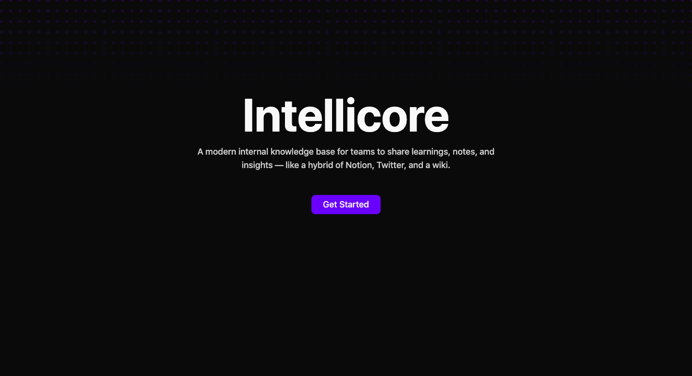

### IntelliCore

A modern internal knowledge base for teams to share learnings, notes, and insights — like a hybrid of Notion, Twitter/X, and a wiki.

# 📚 Intellicore

> A modern knowledge base & team insights app — built with Next.js, Prisma, and Shadcn UI.

---

## 🚀 Live Demo

🔗 [View on Vercel](https://intellicore.vercel.app/)

---

## ✨ Features

- 📊 **Dashboard Analytics** – Post views over time with charts
- 🏷 **Tags & Filtering** – Organize and filter posts by tags
- 💬 **Comments** – Nested comment threads with delete functionality
- ❤️ **Reactions** – Like / upvote posts & comments (comming soon)
- 🔍 **Search** – Find posts by title, content, or tags (comming soon)
- 🖼 **Beautiful UI** – TailwindCSS + Shadcn UI + Framer Motion animations
- 🔒 **Authentication** (optional, if you add NextAuth/Clerk)

---

## 🛠️ Tech Stack

- [Next.js 14](https://nextjs.org/) – App Router, API Routes
- [Prisma](https://www.prisma.io/) – Database ORM
- [PostgreSQL](https://www.postgresql.org/) – Database (via Supabase/Neon)
- [TailwindCSS](https://tailwindcss.com/) – Styling
- [Shadcn UI](https://ui.shadcn.com/) – Accessible
